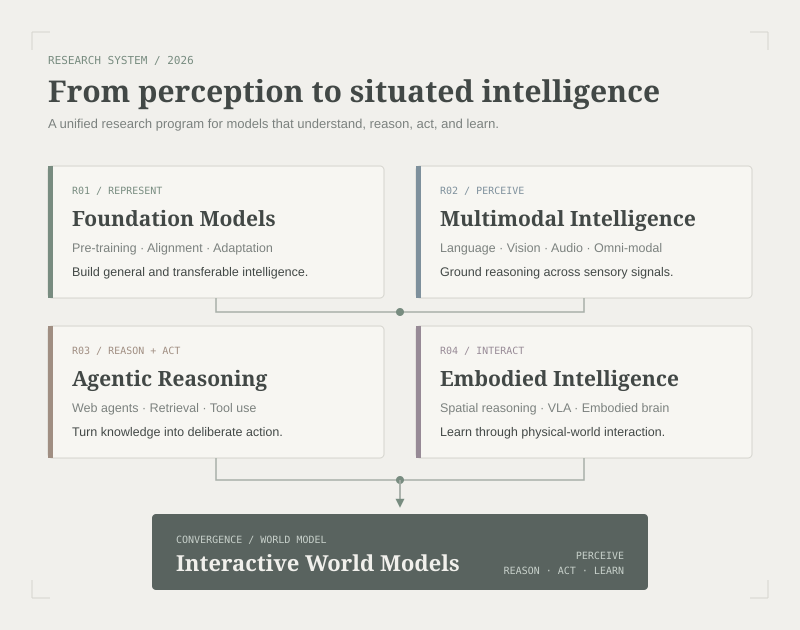

<header class="profile-intro">
  
Artificial Intelligence Researcher

  <h1>Yong Dai</h1>
  
Language models, multimodal intelligence, autonomous agents, and embodied intelligence.

  <nav class="profile-links" aria-label="Profile links">
    <a href="mailto:{{ site.owner.email }}">Email</a>
    <a href="{{ site.owner.scholar }}">Google Scholar</a>
    <a href="{{ '/publications/' | relative_url }}">Publications</a>
  </nav>
  

    
R01Foundation Models

    
R02Multimodal Intelligence

    
R03Agentic Reasoning

    
R04Embodied Intelligence

  

</header>

<section class="home-section bio-section" aria-labelledby="about-heading">
  

    
01

    <h2 id="about-heading">About</h2>
  

  

    
My research bridges large language models and the complex, multimodal world we live in. I completed my Ph.D. at the University of Electronic Science and Technology of China under the guidance of Professor Zenglin Xu, with research experience at Microsoft and Tencent AI Lab.

    
I now focus on <strong>multimodality</strong>, <strong>web agents</strong>, and <strong>embodied intelligence</strong>. I am interested in unified models that can perceive, reason, act, and learn through interaction, with the long-term goal of connecting world models and autonomous agents into capable general-purpose intelligent systems.

  

</section>

<section class="home-section" aria-labelledby="experience-heading">
  

    
02

    <h2 id="experience-heading">Experience</h2>
  

  

    

2021 - 2024

<strong>Research Intern and Researcher</strong> Tencent AI Lab

    

2020 - 2021

<strong>Visiting Student</strong> Westlake University

    

2019 - 2020

<strong>Research Intern</strong> Microsoft STCA NLP Group

    

2018 - 2019

<strong>Project Lead</strong> Research collaboration with Nuance

  

</section>

<section class="home-section" aria-labelledby="research-heading">
  

    
03

    <h2 id="research-heading">Research</h2>
  

  

    <figure class="research-map">
      
      <figcaption>Four connected research directions converge toward interactive world models.</figcaption>
    </figure>
  

</section>

<section class="home-section" aria-labelledby="news-heading">
  

    
04

    <h2 id="news-heading">News</h2>
  

  

    
<time datetime="2026">2026</time>
<em>Optimizing Agentic Reasoning with Retrieval via Synthetic Semantic Information Gain Reward</em> accepted by <strong>ICML 2026</strong>.

    
<time datetime="2026">2026</time>
<em>Web-CogReasoner</em>, a multimodal cognitive reasoning framework for web agents, accepted by <strong>ICLR 2026</strong>.

    
<time datetime="2026">2026</time>
<em>E-ViC</em>, which studies embodied visual chains for spatial intelligence, accepted by <strong>ACL 2026</strong>.

    
<time datetime="2026">2026</time>
<em>Bridging VLMs and Embodied Intelligence with Deliberate Practice Policy Optimization</em> accepted by <strong>ACM MM 2026</strong>.

    
<time datetime="2025">2025</time>
<em>Distribution-Aligned Decoding</em> and <em>InfMasking</em> accepted by <strong>NeurIPS 2025</strong>.

    
<time datetime="2025">2025</time>
<em>Nexus</em> and <em>MME-Finance</em> accepted by <strong>ACM MM 2025</strong>.

  

</section>
