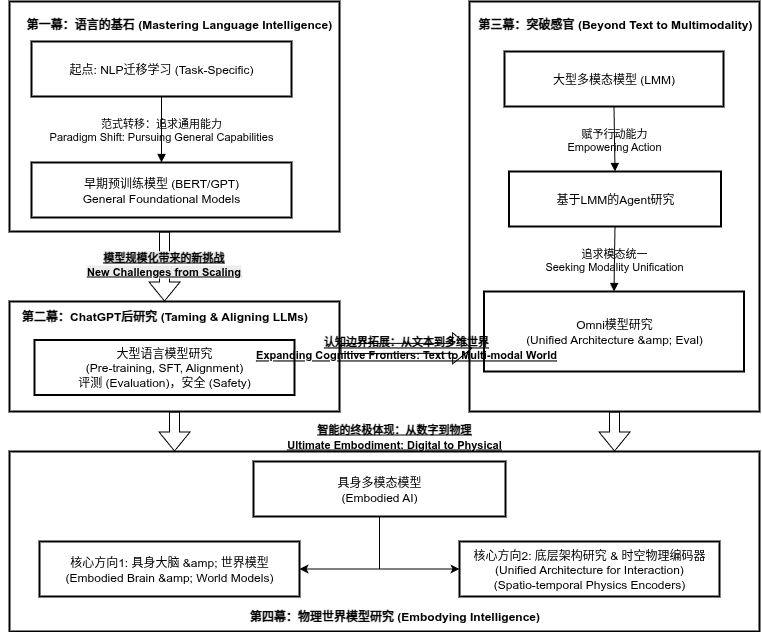

# About Me

Here is **Yong Dai**. 

---

## Brief Bio
As a dedicated AI researcher, my work bridges the gap between large language models and the complex, multi-modal world we live in. My journey began at the University of Electronic Science and Technology of China (UESTC), where I completed my Ph.D. under the guidance of Professor Zenglin Xu. During my doctoral program, I also had the valuable opportunity to learn and grow as a research intern at Microsoft. This experience, combined with my subsequent role as a researcher at Tencent AI Lab, solidified my expertise in harnessing large-scale models for a wide spectrum of downstream tasks.

Recently, my focus has shifted to what I see as the next frontier: **multi-modality** and **web agents**. I am deeply fascinated by the pursuit of a unified paradigm—a single, elegant model that can perceive, reason, and create across text, images, and other data formats. My long-term vision is to contribute to the development of a true "World Model." By integrating such a powerful generative and understanding system with autonomous agent technology, I aim to play a part in building the foundation for **Artificial General Intelligence (AGI)** and creating systems that can truly benefit humanity.

---

## Experience

- 06/21 - 04/24: Research Intern and Researcher, Tencent AI Lab
- 12/20 - 04/21: Visiting student, Westlake University
- 10/19 - 10/20: Research Intern, Microsoft STCA nlpg
- 10/18 - 08/19: Project leader, cooperation project with Nuance

## Research Interests

## News

---

  <table class="news-table">
    <thead><tr><th>Year</th><th>Content</th></tr></thead>
    <tbody>
      <tr><td> <strong>Feb 2025</strong></td><td>🎉 Two papers accepted to ACM MM 2025</td></tr>
      <tr><td> <strong>Sep 2024</strong></td><td>🎉 Two papers accepted to NeurIPS 2024</td></tr>
      <tr><td> <strong>Sep 2024</strong></td><td>🎉 One paper accepted to EMNLP 2024 Findings</td></tr>
      <tr><td> <strong>Jun 2024</strong></td><td>🎉 Three papers accepted to ACL 2024</td></tr>
      <tr><td> <strong>Jun 2023</strong></td><td>🎉 Paper <em>SkillNet-X</em> accepted to ICASSP 2024</td></tr>
      <tr><td> <strong>Dec 2022</strong></td><td>🎉 Paper <em>Federated Learning + PLMs</em> accepted to Findings of ACL 2023</td></tr>
      <tr><td> <strong>Oct 2022</strong></td><td>🎉 Paper <em>Prompt-based Constrained Clustering</em> accepted to Findings of EMNLP 2022</td></tr>
      <tr><td> <strong>Mar 2022</strong></td><td>🎉 Paper <em>Whole Word Masking</em> accepted to Findings of ACL 2022</td></tr>
      <tr><td> <strong>Mar 2022</strong></td><td>🎉 Paper <em>Chinese GPT for Pinyin Input</em> accepted to ACL 2022</td></tr>
      <tr><td> <strong>Jan 2022</strong></td><td>🎉 Paper <em>Graph Fusion Network</em> accepted to KBS</td></tr>
      <tr><td> <strong>Sep 2021</strong></td><td>🎉 Paper <em>Unsupervised Sentiment Analysis</em> accepted to CC</td></tr>
      <tr><td> <strong>Oct 2020</strong></td><td>🎉 Paper <em>Contextualize KBs with Transformer</em> accepted to EMNLP 2021 (Oral)</td></tr>
      <tr><td> <strong>Apr 2020</strong></td><td>🎉 Paper <em>Adversarial Training for Sentiment Analysis</em> accepted to AAAI 2020</td></tr>
    </tbody>
  </table>

